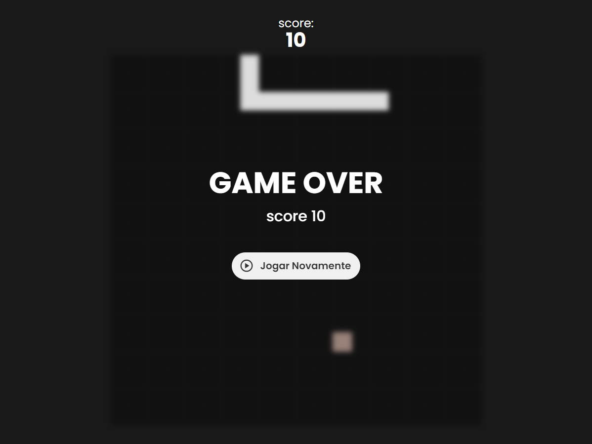

<h1 align="center"> Snake Game </h1>

Jogo da Cobrinha 🐍🙂

  <a href="#-tecnologias">Tecnologias</a>&nbsp;&nbsp;&nbsp;|&nbsp;&nbsp;&nbsp;
  <a href="#-projeto">Projeto</a>&nbsp;&nbsp;&nbsp;|&nbsp;&nbsp;&nbsp;
  <a href="#-layout">Layout</a>&nbsp;&nbsp;&nbsp;|&nbsp;&nbsp;&nbsp;
  <a href="#memo-licença">Licença</a>

  

 

  

## 🚀 Tecnologias

Esse projeto foi desenvolvido com as seguintes tecnologias:

- HTML e CSS
- JavaScript
- Git e Github

## 💻 Projeto

Este projeto é um protótipo do tão nostálgico jogo da cobrinha.

- [Visite o projeto online](https://luad3cristal.github.io/snake-game)

## 🔖 Layout

Você pode visualizar o layout do projeto através [desse link](https://youtu.be/LyWSsZktVOg?si=E5orQLE0PRP_SmsM).

## 📝 Licença

Esse projeto está sob a licença MIT.
